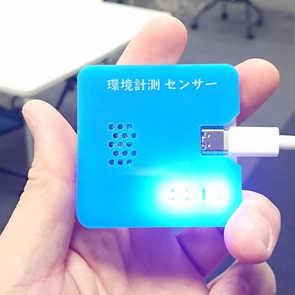
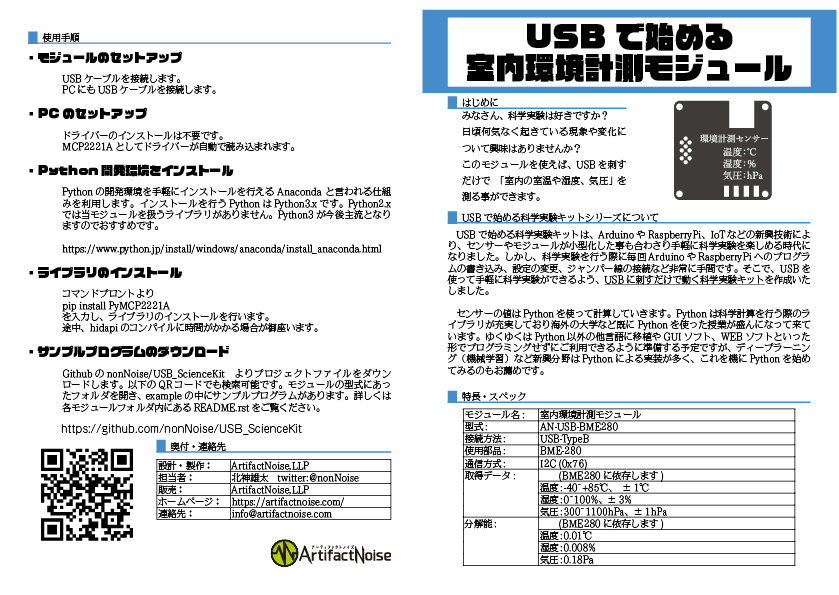
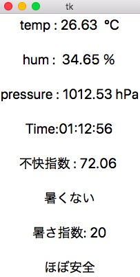

========================================================================
温度／湿度／気圧を計測する　室内環境計測モジュール
========================================================================

作成日:2020/04/26

■ 概要
------------------------------------------------------------------------

USB-TypeCで接続できるお手軽な環境計測モジュールです。

室温、湿度、気圧をそれぞれ計測することができます。

USBドライバはHIDを使用しているため、専用のドライバーは不要です。

また、Pythonで使用できるライブラリもございます。

本モジュールはプログラミングやアプリケーション開発を楽しむ為の物です。

使用するにはプログラムやコマンドについて知識が必要に成ります。

■ 取説
------------------------------------------------------------------------

■ ライブラリインストール
------------------------------------------------------------------------

・モジュールのType-C端子にケーブルを接続します。

.. image:: ./img/01.png

・LEDの点灯を確認します。

・ソースを以下のコマンドでダウンロードします。

git clone https://github.com/ArtifactNoise/AN-BME280-IG.git

・ライブラリをインストールします。

pip3 install PyMCP2221A

・サンプルプログラムを実行します。

cd ./AN-BME280-IG/Python/example

python3 BME280_test.py

.. image:: ./img/02.JPG

■ サンプルプログラム
------------------------------------------------------------------------

コマンドライン
^^^^^^^^^^^^^^^^^^^^^^^^^^^^^^^^^^^^^^^^^^^^^^^^^^^^^^^^^^^^^^^^^^^^^^^^

    https://github.com/ArtifactNoise/AN-BME280-IG/blob/master/Python/example/BME280_test.py

-   初期化
    
    from PyMCP2221A import BME280
    
    device = BME280.BME280()

-   全てのデータ読出し

    device.readData()

-   温度値の関数 [℃]

    device.temperature

-   湿度値の関数 [%]

    device.humidity

    ※ device.var_h　は古い関数で使用しない方向でおねがいします。 

-   気圧値の関数　[pa]

    device.pressure

※ヘクトパスカル(hPa)に変換する際は　device.pressure/100 をします。

GUIアプリ
^^^^^^^^^^^^^^^^^^^^^^^^^^^^^^^^^^^^^^^^^^^^^^^^^^^^^^^^^^^^^^^^^^^^^^^^

https://github.com/ArtifactNoise/AN-BME280-IG/blob/master/Python/example/BME280_GUI.py

KivyによるGUIアプリ
^^^^^^^^^^^^^^^^^^^^^^^^^^^^^^^^^^^^^^^^^^^^^^^^^^^^^^^^^^^^^^^^^^^^^^^^
okajun35様より、Kivyで動くサンプルプログラムを頂きました！　有難うございます！！

https://github.com/okajun35/AN-USB-BME280

.. raw:: html

    <blockquote class="twitter-video" data-lang="ja">
技術書典４で買った<a href="https://twitter.com/nonNoise?ref_src=twsrc%5Etfw">@nonNoise</a>の温度センサー。これはすごい！！ ドライバーのインストールも簡単でなによりPythonで値が取得できる。 ラズパイよりも全然簡単なのでおすすめ。<a href="https://twitter.com/hashtag/%E6%8A%80%E8%A1%93%E6%9B%B8%E5%85%B8?src=hash&amp;ref_src=twsrc%5Etfw">#技術書典</a>　<a href="https://twitter.com/hashtag/%E6%8A%80%E8%A1%93%E6%9B%B8%E5%85%B84?src=hash&amp;ref_src=twsrc%5Etfw">#技術書典4</a> <a href="https://t.co/A5dq0sgeG1">pic.twitter.com/A5dq0sgeG1</a>
&mdash; okazaki jun (@dario_okazaki) <a href="https://twitter.com/dario_okazaki/status/988445093907415041?ref_src=twsrc%5Etfw">2018年4月23日</a></blockquote>
    

■ 参考資料
------------------------------------------------------------------------

::
    
    MIT License
    Copyright (c) 2018 ArtifactNoise,LLP/Yuta Kitagami   
